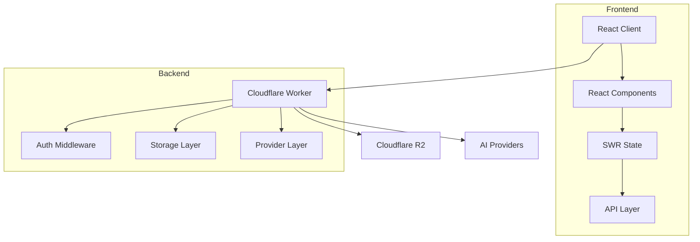

# y-gui 🚀

A web-based graphical interface for AI chat interactions with support for multiple AI models and powerful MCP (Model Context Protocol) integrations. Beyond standard chat capabilities, y-gui leverages MCP to connect with Gmail, Google Calendar, image generation services, and more.

Check out [y-cli](https://github.com/luohy15/y-cli) for a CLI version.

[](https://deploy.workers.cloudflare.com/?url=https%3A%2F%2Fgithub.com%2Fluohy15%2Fy-gui)

## Demo


### MCP in Action
See how y-gui uses MCP integrations to extend AI capabilities:

- [Gmail Integration](https://yovy.app/share/053b3990) - Access and manage emails directly through the chat interface
- [Google Calendar Integration](https://yovy.app/share/fd8e60b5) - Create and manage calendar events via natural language
- [Image Generation](https://yovy.app/share/0e36ad05) - Generate images directly within your chat conversation

## ✨ Features

- 💬 Interactive chat interface with AI models
- 🤖 Support for multiple bot configurations (any base_url/api_key/model combination)
- 🔗 Comprehensive MCP (Model Context Protocol) integration system with:
  - 📧 Gmail access and management
  - 📅 Google Calendar integration for event scheduling
  - 🖼️ Image generation capabilities
  - 🧩 Expandable framework for additional MCP servers and tools
- 🔒 Secure authentication with Auth0 and Google login
- 🌓 Dark/light theme support
- 📝 All chat data stored in Cloudflare R2 for easy access and sync
- 🔄 Real-time updates with SWR
- 📱 Responsive design for all devices

## Architecture

y-gui consists of two main components:

1. **Frontend**: React application with TypeScript, Tailwind CSS, and SWR for data fetching
2. **Backend**: Cloudflare Workers with R2 storage



## ⚡ Quick Start

### Prerequisites

1. Node.js and npm
2. Cloudflare account
3. Auth0 account
4. API keys for AI providers

### Installation

1. Clone the repository:
   ```bash
   git clone https://github.com/luohy15/y-gui.git
   cd y-gui
   ```

2. Install dependencies:
   ```bash
   npm install
   ```

3. Configure environment variables:
   - Configure Cloudflare Worker settings in `backend/wrangler.toml`
   - Change the auth0 settings in `frontend/src/index.tsx` and `backend/src/utils/auth.ts`

4. Build asset:
   ```bash
   npm run build
   ```

5. Deploy cloudflare worker
   ```bash
   npm run deploy
   ```

## 🛠️ Development

### Project Structure

```
y-gui/
├── frontend/               # React frontend application
│   ├── src/
│   │   ├── components/     # React components
│   │   ├── contexts/       # React contexts
│   │   ├── utils/          # Utility functions
│   │   └── index.tsx       # Entry point
├── backend/                # Cloudflare Worker backend
│   ├── src/
│   │   ├── api/            # API endpoints
│   │   ├── middleware/     # Middleware
│   │   ├── repository/     # Data access
│   │   └── index.ts        # Worker entry
├── shared/                 # Shared code between frontend and backend
│   └── types/              # TypeScript type definitions
└── memory-bank/            # Project documentation
```

### Available Scripts

- `npm run dev`: Start both frontend and backend development servers
- `npm run dev:frontend`: Start only the frontend development server
- `npm run dev:backend`: Start only the backend development server
- `npm run build`: Build both frontend and backend
- `npm run deploy`: Deploy the backend to Cloudflare Workers
- `npm run test`: Run tests

## 🔒 Authentication

y-gui uses Auth0 for authentication with the following features:

- Universal Login
- Google social login
- Token-based session management
- Secure API access

## 🤖 Bot Configuration

y-gui supports multiple bot configurations with the following properties:

- Name
- Model
- Base URL
- API Key
- Print Speed
- MCP Servers
- API Type
- Custom API Path
- Max Tokens
- Reasoning Effort

## 🔗 MCP Server Configuration

MCP (Model Context Protocol) servers can be configured with simple:
- **Name**: Unique identifier for the MCP server
- **URL**: For remotely hosted MCP services
- **Token**: Authentication token for secure server access

Current MCP integrations include Gmail, Google Calendar, image generation, and support for custom servers to connect with virtually any API or service.

## 🌐 API Endpoints

The backend provides RESTful API endpoints for:

- Chat operations
- Bot configuration management
- MCP server configuration management
- Authentication

## 🔄 Data Storage

- Chat data is stored in Cloudflare R2
- Bot and MCP server configurations are stored in Cloudflare R2
- MCP integration data is securely managed through authorized API connections

## 🧩 Technologies Used

- **Frontend**: React, TypeScript, Tailwind CSS, SWR, Auth0
- **Backend**: Cloudflare Workers, R2
- **Integrations**: MCP servers, OAuth2, Gmail API, Google Calendar API, Image Generation APIs
- **Build Tools**: Vite, Wrangler, TypeScript

## 📚 Documentation

For more detailed documentation, see the [memory-bank](./memory-bank) directory.

## 🤝 Contributing

Contributions are welcome! Please feel free to submit a Pull Request.

## 📄 License

This project is licensed under the MIT License - see the LICENSE file for details.
