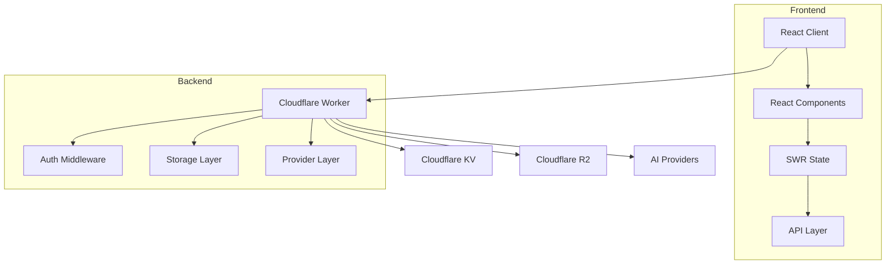
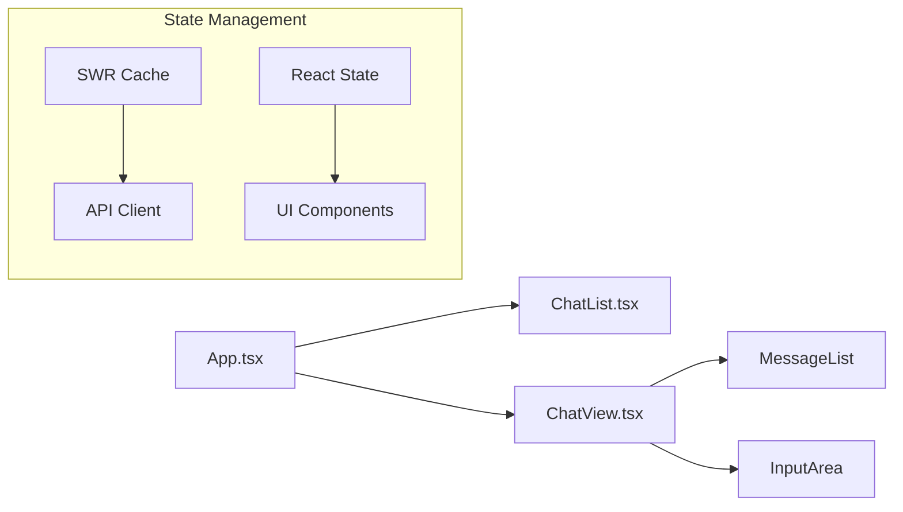

# System Patterns: y-gui

## Architecture Overview

### Core Components


## Design Patterns

### Repository Pattern
- Implemented in KVStorageRepository
- Handles data operations with Cloudflare KV and R2
- Provides consistent interface for data access
- Manages chat data persistence and retrieval

### Component Pattern
- React functional components with hooks
- Modular UI structure
- Reusable component library
- Clear component hierarchy

### State Management
- SWR for data fetching and caching
- React hooks for local state
- Optimistic updates for better UX
- Consistent state synchronization

### Authentication Pattern
- Secret key validation
- Token-based session management
- Secure middleware implementation
- Local storage for token persistence

## Component Relationships

### Frontend Architecture


### Backend Architecture
```mermaid
flowchart LR
    Worker[Worker] --> Auth[Auth Middleware]
    Auth --> Router[API Router]
    Router --> Storage[Storage Layer]
    Router --> Provider[Provider Layer]

    subgraph "Storage"
        Storage --> KV[KV Operations]
        Storage --> R2[R2 Operations]
    end
```

## Key Technical Decisions

### Frontend Structure
- React with TypeScript
- Tailwind CSS for styling
- SWR for data management
- Component-based architecture

### Backend Structure
- Cloudflare Workers
- KV and R2 for storage
- Middleware pattern for auth
- RESTful API design

### Data Flow
- Unidirectional data flow
- Optimistic updates
- Real-time synchronization
- Error boundary handling

### Authentication Flow
- Secret key validation
- JWT token generation
- Token storage in localStorage
- Secure API requests

## Error Handling
- Global error boundaries
- API error handling
- Loading states
- User feedback
- Retry mechanisms

## Extension Points
- Additional UI components
- New API endpoints
- Enhanced authentication
- Storage optimizations
- Provider integrations

## Testing Strategy
- Component unit tests
- Integration tests
- API endpoint tests
- Authentication testing
- Storage layer tests

## Performance Patterns
- SWR caching
- Optimistic updates
- Lazy loading
- Asset optimization
- Edge deployment

## Security Patterns
- Authentication middleware
- Secure token handling
- API request validation
- Data sanitization
- Error message security
